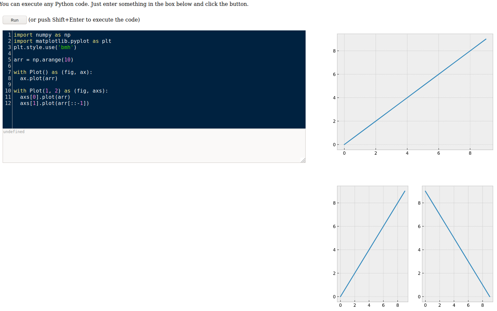

# pybonacci-runpy

Code for the python code editor and runtime included in [pybonacci.org](https://pybonacci.org/runpy/).

It works thanks to:

* Pyodide
* Codemirror
* All the python community (CPython, numpy, scipy, matplotlib, pandas,...).

You can use it on your own web page to run Python code.

## Modifications included

* `print` from Pyodide prints directly in the JS console of your browser. The `print` used in this editor is modified so you can print in the
output textarea in the webpage instead of the JS console. If you want to use the original `print` from Pyodide it is renamed to `_print`. 
* There is a context manager to manage matplotlib figures that you can use to print in the webpage (right area). It could be used liek this:

```python
with Plot() as (fig, ax):
    ax.plot((1,2,3))
```
And the figure will appear in a HTML `img` tag in the webpage.

If you want to use several axes you can use:

```python
with Plot(1, 2) as (fig, axs):
    axs[0].plot((1,2,3))
    axs[1].plot((3,2,1))
```

## Test it Here

[https://pybonacci.org/runpy/](https://pybonacci.org/runpy/)

## Screenshots


